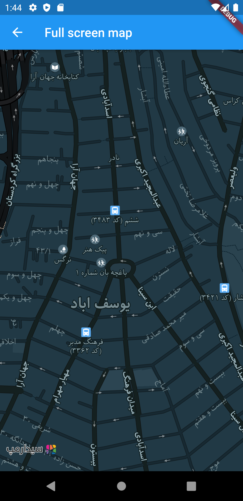

# Cedarmaps Flutter SDK

> **Please note that this project is based on a community driven Mapbox GL plugin.** We welcome [feedback](https://github.com/tobrun/flutter-mapbox-gl/issues) and contributions.

This Flutter plugin allows to show embedded interactive and customizable vector maps inside a Flutter widget. For the Android and iOS integration, we use [mapbox-gl-native](https://github.com/mapbox/mapbox-gl-native). For web, we rely on [mapbox-gl-js](https://github.com/mapbox/mapbox-gl-js). This project only supports a subset of the API exposed by these libraries. 



## Running the example app

- Install [Flutter](https://flutter.io/get-started/) and validate its installation with `flutter doctor`
- Clone the repository with `git@github.com:cedarstudios/cedarmaps-flutter-sdk.git`
- Add a CedarMaps clientID and clientSecret to the example app (see next section)
- Connect a mobile device or start an emulator, simulator or chrome
- Locate the id of a the device with `flutter devices`
- Run the app with `cd flutter_mapbox/example && flutter packages get && flutter run -d {device_id}`

## Adding CedarMaps Credentials

This project uses CedarMaps vector tiles, which requires a CedarMaps clientID and a clientSecret. Obtain your free credentials on [CedarMaps webpage](https://www.cedarmaps.com).

The **required** way to provide your credentials is through the `CedarMapsMap` constructor's `clientID` and `clientSecret` parameters. Note that you should always use the same credentials in your entire app.

## Using the SDK in your project

This project is available on [pub.dev](https://pub.dev/packages/cedarmaps), follow the [instructions](https://flutter.dev/docs/development/packages-and-plugins/using-packages#adding-a-package-dependency-to-an-app) to integrate a package into your flutter application. For platform specific integration, use the flutter application under the example folder as reference. 

## Supported API

| Feature | Android | iOS | Web |
| ------ | ------ | ----- | ----- |
| Style | :white_check_mark:   | :white_check_mark: | :white_check_mark: |
| Camera | :white_check_mark:   | :white_check_mark: | :white_check_mark: |
| Gesture | :white_check_mark:   | :white_check_mark: | :white_check_mark: |
| User Location | :white_check_mark: | :white_check_mark: | :white_check_mark: |
| Symbol | :white_check_mark:   | :white_check_mark: | :white_check_mark: |
| Circle | :white_check_mark:   | :white_check_mark: | :white_check_mark: |
| Line | :white_check_mark:   | :white_check_mark: | :white_check_mark: |
| Fill | :white_check_mark:   | :white_check_mark: |  |

## Map Styles

Map styles can be supplied by setting the `style` in the `MapOptions`. The following styles are supported:

1. `MapStyle.LIGHT` for light themed vector tiles, which is the default value.
2. `MapStyle.DARK` for dark themed vector tiles.
3. `MapStyle.LIGHT_RASTER` for light themed raster tiles.

## Location features
To enable location features in an **Android** application:

You need to declare the `ACCESS_COARSE_LOCATION` or `ACCESS_FINE_LOCATION` permission in the AndroidManifest.xml and starting from Android API level 23 also request it at runtime. The plugin does not handle this for you. The example app uses the flutter ['location' plugin](https://pub.dev/packages/location) for this. 

To enable location features in an **iOS** application:

If you access your users' location, you should also add the following key to your Info.plist to explain why you need access to their location data:

```xml
<key>NSLocationWhenInUseUsageDescription</key>
<string>[Your explanation here]</string>
```

Mapbox [recommends](https://docs.mapbox.com/help/tutorials/first-steps-ios-sdk/#display-the-users-location) the explanation "Shows your location on the map and helps improve the map".

## Documentation

This README file currently houses all of the documentation for this Flutter project. Please visit [mapbox.com/android-docs](https://www.mapbox.com/android-docs/) if you'd like more information about the Mapbox Maps SDK for Android and [mapbox.com/ios-sdk](https://www.mapbox.com/ios-sdk/) for more information about the Mapbox Maps SDK for iOS.

## Getting Help

- **Need help with your code?**: Look for previous questions on the [#mapbox tag](https://stackoverflow.com/questions/tagged/mapbox+flutter) — or [ask a new question](https://stackoverflow.com/questions/tagged/mapbox+android).
- **Have a bug to report?** [Open an issue](https://github.com/tobrun/flutter-mapbox-gl/issues/new). If possible, include a full log and information which shows the issue.
- **Have a feature request?** [Open an issue](https://github.com/tobrun/flutter-mapbox-gl/issues/new). Tell us what the feature should do and why you want the feature.